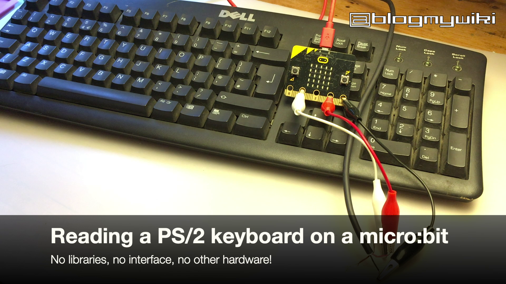

# microbit-ps2-keyboard

A Python program to read a PS/2 keyboard on a BBC micro:bit. No interface or special hardware is needed, just a PS/2 keyboard and a micro:bit.

## How to set it up

Flash mb-ps2-keyboard-reader.py on to a micro:bit.

The plug was already cut off the PS/2 keyboard I found in the street, which meant I didn't waste time and money buying a socket, I just used crocdile clip leads.

- Attach pin 1 on the micro:bit to your keyboard’s data wire – mine was white but yours may not be.
- Connect your micro:bit 3v pin to the keyboard’s power wire (pink in my case)
- Connect micro:bit GND pin to keyboard Ground (black on my old Dell keyboard)

Type your message quite slowly. Letters will flash on the micro:bit display. The Caps Lock key toggles upper and lower case, but the shift key does nothing. 

I have not tested this with other keyboards, so you may need to tweak the baud rate. This is a very simple set up that ignores the keyboard's clock signal and attempts to read all output from the keyboard as raw serial data.

## More info

http://www.suppertime.co.uk/blogmywiki/2020/08/ps2-keyboard-microbit/

